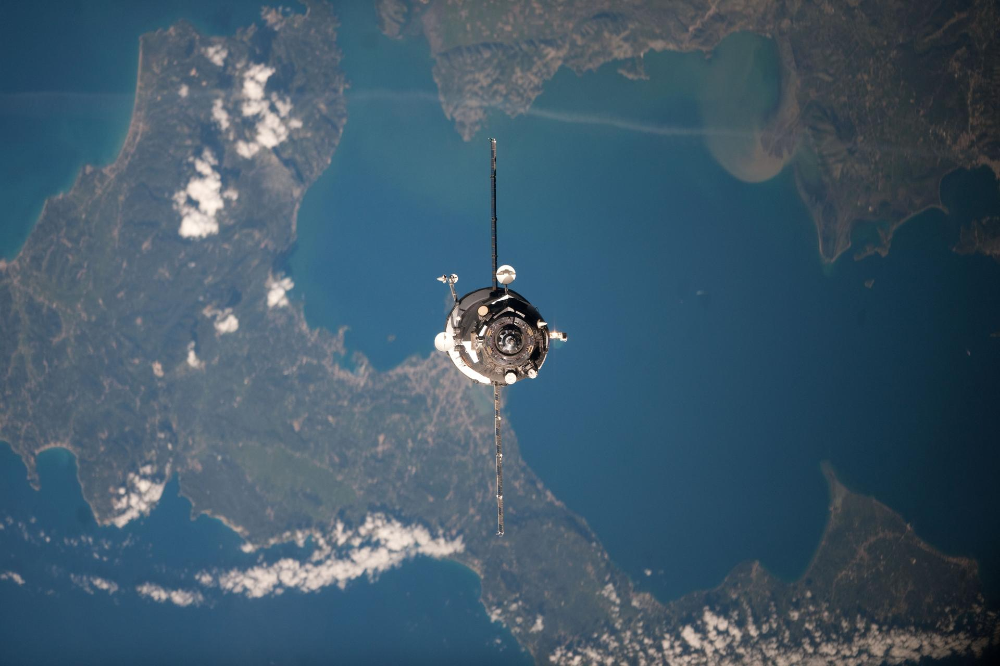

# Identifying Houses in Areas without Addresses - House Finder

    <figure>
        
        <figcaption>Photo Credit: [NASA](https://images.nasa.gov/details/iss030e254053) (ISS030-E-254053 (22 April 2012))</figcaption>
    </figure>

## Problem Statement
Though common throughout most western countries and localities, unified building address systems are not universally available.  From remote communities in Africa and Ireland to [Carmel by the Sea in California]('https://ci.carmel.ca.us/post/addresses#:~:text=A%20unique%20characteristic%20of%20Carmel,houses%20south%20of%2012th%20Avenue%E2%80%9D'), _descriptive addresses_ are common and often require local knowledge to navigate.  Guiding deliveries and guests to unaddressed locations often requires providing detailed directions or providing local help, though providing a GPS location via a 'pin' in a mapping software is common in some areas.

Several attempts to address this gap have been undertaken by overlaying the planet with a grid and assigning unique identifiers to grid references.  [Google's PlusCodes]('https://maps.google.com/pluscodes/') assigns alphanumeric codes, organized logically to grid space.  [what3words]('https://what3words.com/clip.apples.leap') assigns a combination of three unique words in multiple languages along a similar schema.

_***But what if you don't know the identifier and can't really find someone to ask?***_

I have personally run into this on two occasions while trying to find the location of a house we were staying at in Donegal County, Ireland - and a similar experience on the Greek island of Corfu.  I had a picture of the house and a rough location, but no address.  It's not always easy to find "Tom's house, down the way from the Pub" in the dark!  To solve this issue, I found myself leveraging satelite images - identifying distinct features in images and attempting to locate the house by physical relationship.  The material (color) and shape of the roofs visible in images taken from the ground (or from inside the property) were the most consistently useful datapoints.  I took a few wrong turns, but eventually found the destination.

### Goal
This project seeks to leverage publicly available satelite and aerial imagery of unaddressed areas to identify buildings, roof types and materials and provide users with a map narrowing down likely destinations.  In cases where the town/city designation, paired with the roof description is unique, the goal is to create a geolocation of of the building they are looking for.  Otherwise, this project seeks to reduce the number of wrong turns taken in unfamiliar, unaddressed areas.

***How might this be leveraged in practice?***

Once an area is processed, users can take the following steps to help identify their destination:
1. Type in the name of their destination's village or town (ex. Agios Matheos)
2. Review available images of the building and select a roof color (ex. Red Tile)
3. Provide a best guess of the roof style, designated by the number of roof ridges (ex. one ridge)

The model will then assess the aerial imagery availabe (in this implementation, sourced from Google's Earth API) to identify buildings in the specified area and return building locations (latitude and longitude) of buildings matching the provided description.

### Methodology
This project requires the usage of a wide range of libraries and methods within the geopspatial analysis and data science disciplines.  A brief overview of the stages involved is listed below with details of the project provided in relevant sections later in this document.

#### 1. Define Geographic Boundaries
Before capturing satelite images covering the Earth, setting fixed boundaries over which to search is key to capture relevant and useful images.  For this project, the Greek island of Corfu is of interest.  As Greece's 7th largest island (>610 sq. km), a secondary search area is defined by one of the island's 16 municipalities

Island and relevant municipal boundaries are sourced from the Greek Government in the form of shapefiles.  These are re-projected into a common map projection and filtered to create relevant boundaries (ex. coastline) over which to search.
For more details, see [here](###-geographic-boundaries).

#### 2. Source Aerial Imagery
Satelite Imagery is captured using Google's Earth Engine API and Google Satelite imagery.  Images are captured in two offset overlapping grids within the designated geographic boundary to maximize coverage and capture of complete buildings within individual images.  To aid in locating houses geographically, images are named with the latitude and longitude of the center of the image.

For more details, see [here](###-satelite-and-aerial-imagery).

#### 3. Model Selection
Matterport's Mask-RCNN model was selected to take advantage of a high quality, open source instance segmentation Convolutional Neural Network, and to minimize training time and resource requirements.  A version of the model upgraded for compatibility with Tensorflow versions 2+ was sourced from a branch created by Adam Kelly (aktwelve) via github and run in Google Colab.

For more details, see [here](###-model-selection)

#### 4. Source and Prepare Training Data
The Spacenet V2 [dataset](https://spacenet.ai/spacenet-buildings-dataset-v2/) is leveraged as the primary training data for this project.  Specifically, the smallest dataset covering portions of Khartoum, Sudan is leveraged due to data size constraints and model fitting time requirements.  This dataset is ideal in training a model to segment instances of buildings from satelite images, as the images are of high quality and each are provided with an accompanying mask for each building in a .geojson format.  Additional datasets were sourced

For more details, see [here](###-source-and-prepare-training-data)

#### 5. Instantiate a Pre-Trained Convolutional Neural Network

#### 6. Evaluate Model Outputs and Identify Roof Colors 

---
## Data Sourcing and Preparation
### Geographic Boundaries
[Notebook](./code/01_Shoreline_Boundary.ipynb)
#### Sourcing
Though it is possible to capture arerial and satelite imagery covering the entirety of the planet, it would not be useful (oceans and seas), nor practical (data volume) to do so.  Two methods are available to establish boundaries, whithin which imagery can be captured:
1) ***Bounded Box*** - A simple box of Latitude and Longitude minimum and maximum values.  The result would cover a rectangle (map projectios notwithstanding).  This simpler approach would work well if a segment of a city is the area of interest, for example.
2) **Geometrically Defined Boundary*** - Leveraging geometric data (such as the border of a country or a coastline) protects against capturing irrelevant images.  In the case of an island, restricting capture to images on the island - and not the sea is preferable.

This project leverages a _blended_ approach.  Shapefiles (defining geographic boundaries) are isolated to the area of interest.  The minimum and maximum latitude and longitude values of the bounding geomertry is used to instantiate the outer limits of the search grid.  Images are considered gridwise across the search grid.  At each point, if the center of the image is outside the established geographic boundary, the image is not captured.

This project (focused on the Greek island of Corfu) leverages shapefiles available at Geodata.gov.gr for [Country Borders](https://geodata.gov.gr/en/dataset/aktogramme/resource/1ba9f74e-eb7a-4d0d-8858-864218806dbc) and 
Source: [Municipalities](https://geodata.gov.gr/en/dataset/oria-demon-kapodistriakoi), respectively.  For clarity, municipalities leveraged are defined by the Kapodistrias plan.

#### Preparation
Shapefiles are imported using the GeoPandas library.  Adjustments are made to the map projection (crs) to ensure compatibility with common latitude, longitude coordinate systems.

Line segments provided in the shapefile (on the order of a kilometer in length) are combined into closed shapes (beaches form an island).  The greek border shapefile covers the entirety of Greece, including the mainland and its many islands.  As the area of focus is Corfu, the correct geometry object must be isolated.  Names are not provided, so a sorted list of geometries is created by enclosing area.  Corfu is the seventh largest island in Greece, which enables identification and isolation.

Municipalities similarly cover the entirety of Greece, but names are provided for reference and filtering.  Here 'Ν. ΚΕΡΚΥΡΑΣ' (the Greek named for the island "Kerkyra") is used to filter to municipalities on the island.  The municipality of 'ΑΓΡΟΣ' (Agros) is selected to enable further segmentation of the island if needed.

---
### Satelite and Aerial Imagery
[Notebook](code/01_Image_Sourcing.ipynb)
#### Sourcing
The core of this project is the use of high quality satelite or (consistently sourced) aerial imagery covering an unaddressed area.  After assessing imagery available from NASA and Google's Earch Engine, Earth Engine was selected due to ease of use and exceptional documentation.  This includes a Google Colab Setup Guide provided in an .ipynb notebook [here](https://colab.research.google.com/github/google/earthengine-api/blob/master/python/examples/ipynb/ee-api-colab-setup.ipynb).  Google Earth Engine operates via API, and requires an account to be created and API keys to be generated and used for each session.

#### [Imagery Selection](code/01_Image_Sourcing.ipynb##-select-projection-and-imagery-from-open-source-google-earth-engine)
Once a notebook is connected to Google's Earth Engine, HTML maps can be generated and displayed in a similar manner to those available on Google Maps, including zoom and drag functionality.  The baseline map does not provide satelite imagery, but does highlight road networks, towns, and other road-atlas relevant features.  The [folium](https://python-visualization.github.io/folium/modules.html) library can be leveraged to source and overlay a wide array of images, including multiple satelite sources.  Map layers (leaflets) can be explored and sourced from [leaflet providers on Github](http://leaflet-extras.github.io/leaflet-providers/preview/).

Each available leaflet was explored at high levels of zoom in an effort to select a leaflet which includes high quality images at a low zoom level (houses can be seen clearly when looking at a small geographic area.).  ESRI Imagery, provided via arcgis, enables a deep level of zoom, but imagery over the Island of Corfu is a bit blurry (image below).  This may make identifying individual buildings more difficult for a neural network, as the boundaries are clearly defined at high levels of zoom.

<figure>
    
    <figcaption>Agios Matheos - ESRI Imagery</figcaption>
</figure>

Another common library which commonly leverages the Google Earth Engine API is the geemap library.  The [documentation](https://github.com/gee-community/geemap/blob/master/geemap/basemaps.py) for this library contains a reference to the Google Satelite imagery.  Though this imagery is not available through the leaflet sources mentioned above (as ESRI imagery), it can be called via the Google Earth Engine if specified.  As shown below (with the same zoom level and map boundary), Google's Satelite imagery is much clearer for this area at high zoom levels.  As a result, this is the visualization layer selected for satelite image capture for this project.

<figure>
    
    <figcaption>Agios Matheos - Google Earth Imagery</figcaption>
</figure>

#### [Image Capture](code/01_Image_Sourcing.ipynb##-capture-small-scale-images)
> Disclaimer: This project is undertaken for exploratory and educational purposes.  Commercial use of images sourced through Google Earth Engine or other sources is generally prohibited.  Special limitations on use of specific leaflet layers may bear additional usage restrictions.

With geographic boundaries established and an imagery leaflet layer selected, the next step is to collect a gridwise sample of satelite images to serve as evaluation data for modeling (the area over which to identify and categorize buildings).  The first stage is defining the zoom level for the images to be captured.  Each leaflet image layer has a fixed maximum zoom limit.  This is generally the maximum useful zoom level to maintain resolution. 

> Though I am no expert in digital photography, one can think of this like older digital cameras - users can zoom in physically (the lenses on the camera move) without sacrificing the quality of the image captured.  Digital zoom can extend this range (the lenses no longer move), but the image resolution is compromised... the camera effectively "stretches" the pixels it reads to fill the desired frame.  This is also how 'pinch to zoom' works on smartphone cameras.

Here the maximum zoom level is selected (18 for Google Satelite Imagery) to maximize pixel density over a small area.

A frame size of 300x310 pixels is used for the images captured.  This may seem small, but this is chosen for two purposes:
1. Convolutional Neural networks are generally well suited for smaller images - this project also aims to identify individual buildings from the image.  Tuning the size of the images into digestable chunks is hypothesized to yield better accuracy and model performance (it is likely to find 10 houses from a small image than 100 houses in a larger image)
2. Geographic Area Covered.  At a zoom level of 18 and 310 pixels in height, each frame covers approximately 0.0012 degrees latitude... or 130 meters.  A lot of small houses can fit into an area roughly twice the size of a football pitch.

At this image size, a single gridwise map covering the island of Corfu would result in 118000 images being considered or captured.  For the municipality of Agros, this is closer to 4000 images.  

Furthermore, images must be captured in two overlapping grids to maximize the instances of complete buildings being present in images.  A illustrative process flow of the image capture procedure is provided below.

<figure>
    
    <figcaption>1. Primary images are captured to create a grid covering the island boundaries within the maximun defined extents (cardinal directions) of the island.  Representative primary images boundaries are roughly identified by blue boxes.</figcaption>
</figure>

<figure>
    
    <figcaption>2. A secondary grid of images are captured within the same boundaries with a one-half width and height offset to the primary grid.  Any buildings which were divided into multiple images in the primary grid are captured entirely within one image on the secondary grid.  Representative primary images boundaries are roughly identified by orange boxes.</figcaption>
</figure>

<figure>
    
    <figcaption>3. Geographic Boundary Control - As each section of the grid is instantiated, the geographic boundary is considered prior to image capture.  Here the coastline is represented by a dashed green line.  If the center of the grid falls inside the geographic boundary (a closed shape), the image is captured.  Otherwise the image is skipped and the process moves to the next grid point.</figcaption>
</figure>

Capturing each image requires five steps, accomplished in a single function:
1. Identify wither the center of the image is within the designated boundary geometry
2. Call Google Earth Engine API with the designated latitude/longitude, image size and zoom level - this returns an html window
3. Save the HTML window in a temporary folder - leveraging the latitude and longitude of the image in the file name
4. Call the imgkit library to read the html object and save the output as a .png file
5. Delete the temporary HTML file to save space.

Using the above process, thousands of high quality, relevant satelite and aerial images of consistent size and are captured quickly and available for modeling.  Some examples are below:

<figure>
    
    <figcaption>Fuel Station between Troumpetas and Chorepiskopi</figcaption>
</figure>
<figure>
    
    <figcaption>Chorepiskopi</figcaption>
</figure>
<figure>
    
    <figcaption>Olive Tree Grove - Agros, Corfu</figcaption>
</figure>

---
### Model Selection

The goal of this project is to leverage the images captured above to identify instances of buildings - and details about these buildings.  For this application, a Convolutional Neural Network is the best candidate machine learning model type.  Specifically, a Convolutional Neural Network which is designed to identify one or more instances of one or more classes of object within an image.  These model

<blockquote>
    <strong>A brief summary of Neural Networks and Convolutional Neural Networks</strong>   
    
 - Machine Learning models considers input data and known answers (training data) to iteratively learn the rules which associate the inputs and resulting answers.  These rules can then be used to predict answers from unseen data.  
    - Neural Networks are a collection of relatively simple models (nodes) organized in successive layers to accomplish the same type of iterative learning using training data.  In most implemenetations, the nodes of each layer feed their output to successive layers in the model.  Nodes in deeper layers are not considering the input data directly, but <i>a representation of the input data generated by upstream layers</i>.  This enables Neural Networks to assess more complex relationships between the inputs and answers.  
        - Convolutional Neural Networks introduce <i>Convolution Layers</i> to a Neural Network.  These layers enable the model to assess arrays of numbers (often images) organized in multiple dimensions.  Boiled down, Convolution Layers 'look at' a small subset of the 'image' similar to the gridwise image capture approach above and calculate ouptputs to create a new representation of the input data.  One key feature is that these layers enable the network to identify features of an input without respect to their position.  Convolutional Neural Networks are the cornerstone of computer vision in applications like image classification (cat or dog?), object detection (lines on the road in self driving cars), and instance segmentation (identifying and reading a roadsign).  
</blockquote>

<a href="https://github.com/matterport/Mask_RCNN">Mask-RCNN</a> is a pre-trained Convolutional Neural Network used for Instance Segmentation.  One guiding principle of Neural Networks is that as the rules you are attempting to learn grow in complexity, the amount of data needed to train the model increases as well.  Mask-RCNN has been trained on a range of very large datasets, which enable it to break down input images efficiently and identify instances of objects.  It can also be retrained to find new 'classes' of objects (like buildings) reasonably quickly - as the internal rules of breaking down an image have already been learned.  This makes Mask-RCNN a great model to leverage when seeking to identify individual houses from satelite imagery!   
        Mask-RCNN's output when considering an image of a street below provides an illustration of both instance identification (individual boxes for instances of each type of object identified) and masking (the highlight overlay of the pixels that make up each object.)
        <figure>
            
            <figcaption>Sample Mask-RCNN Output.  Credit: Matterport.  <a hreff = "https://github.com/matterport/Mask_RCNN"> Source Link</a></figcaption>
        </figure>

One note is that Mask-RCNN is not directly compatible with the current versions (2+) of the Tensorflow Library (which is used to run a wide range of neural networks, especially in Google's Colab environment).  For this project, a version of Mask-CNN upgraded to work with Tensorflow v2+ was sourced from Adam Kelly (aktwelve) <a href="https://github.com/akTwelve/Mask_RCNN">via Github</a>.  Many thanks to Adam and their collaborators for their work in ensuring this model is still usable!  Additional adjustments made to the model are listed in the Modeling section below.

---
### Source and Prepare Training Data

[Notebook](code/04_Training_Data.ipynb)

#### Sourcing
Machine Learning models make predictions on a like-for-like basis with the answers ("targets") they were trained on.  A model asked to predict a house price will need to be trained with house prices as a target.  A model trained to identify pictures of cats vs. dogs will need to be trained on labeled images of cats and dogs (and because the task is more complex, a lot more photos.).  This project seeks to generate masks (the highlighted sections) which comprise buildings from aerial photos.  Therefore, a dataset comprised of aerial images and <i>individual building masks</i> will be required for training.  Thankfully, this data is publicly available from Spacenet.ai.

Spacenet V2 is a publicly available dataset from [Spacenet.ai](https://spacenet.ai/about-us/).  This data is commonly used in Spacenet-operated geospatial machine learning challenges similar to those operated on kaggle.com.  The Spacenet V2 [dataset](https://spacenet.ai/spacenet-buildings-dataset-v2/) covers four cities and provides maps of category-masked images, including maps for buildings viewed from satelite photography.  This data is ideal to train a Convolutional Neural Network to identify, locate and mask individual buildings for this project.

Spacenet V2 data is available for download via Amazon S3 bucket or from [Radiant MLHUB](https://mlhub.earth/data/spacenet2).  For this project, I downloaded the Khartoum dataset from Radiant MLHUB.  It is the smallest of the four available datasets, which enables faster training times in line with the time constraints for this project.  Examples of the pre-processed images are below.

<blockquote>
    <strong>A note on extended use cases:</strong> 
    Additional data is available from the Spacenet V2 dataset covering cities including sections of Las Vegas, Paris and Shanghai.  This data could be preprocessed and leveraged to train Mask-RCNN in combination with the Khartoum data leveraged for this project to improve accuracy of predictions across a wider range of use cases.    
    In addition, data is sourced from <a href = "https://github.com/loosgagnet">loosgagnet via github</a> which could also be used to refine the model and open transfer learning opportunities.  Details on three such datasets imported but not utilized in the project directly are below:   
    <strong>Building Detection and Roof Type Data</strong> from <a href="https://github.com/loosgagnet/Building-detection-and-roof-type-recognition">loosgagnet - Building-detection-and-roof-type-recognition</a>

This dataset was created by the research team leading: [A CNN-Based Approach for Automatic Building Detection and Recognition of Roof Types Using a Single Aerial Image - Alidoost & Arefi, 2019](https://link.springer.com/article/10.1007/s41064-018-0060-5)

It consists of two training datasets for the above named paper:
1. **Building Detection** - includes three classes of urban objects such as buildings, roads and trees (4800 IR-R-G images per class, after data augmentation)
1. **Roof-Type Detection** - includes three classes of roofs such as flat, gable and hip roofs (4800 IR-R-G images per class, after data augmentation)

Citation: Fatemeh Alidoost, Hossein Arefi; “A CNN-Based Approach for Automatic Building Detection and Recognition of Roof Types Using a Single Aerial Image”, PFG – Journal of Photogrammetry, Remote Sensing and Geoinformation Science, December 2018, Volume 86, Issue 5–6, pp 235–248, https://doi.org/10.1007/s41064-018-0060-5   
    <strong>Roofline Extraction Dataset</strong> from <a href='https://github.com/loosgagnet/Roofline-Extraction'>loosgagnet Roofline-Extraction via Github</a>

This dataset was created by the research team leading: [2D Image-To-3D Model: Knowledge-Based 3D Building Reconstruction (3DBR) Using Single Aerial Images and Convolutional Neural Networks (CNNs)]('https://doi.org/10.3390/rs11192219')

It consists of cropped images, nDSMs, and roof elements including three classes of eaves (red), ridges (green) and hips (blue)  
    <figure>
        
        <figcaption>loosgagnet Roofline Extraction - images processed for this project</figcaption>
    </figure>

---
Citation: Fatemeh Alidoost, Hossein Arefi, Federico Tombari; “2D Image-To-3D Model: Knowledge-Based 3D Building Reconstruction (3DBR) Using Single Aerial Images and Convolutional Neural Networks (CNNs)”, Remote Sens. 2019, 11, 2219, [https://doi.org/10.3390/rs11192219]('https://doi.org/10.3390/rs11192219')
</blockquote>

#### Pre-Processing SpacenetV2 Data
SpacenetV2 Data is available in tar.gz files for each city.  Once extracted, the data requires significant pre-processing before being leveraged in modeling.  Details of the cleaning process are provided below and handled sequentially in the linked [notebook](code/04_Training_Data.ipynb).  Mustafa Aktas' <a href='https://github.com/Mstfakts/Building-Detection-MaskRCNN/tree/master'>Building Detection with MaskRCNN project on github</a> was leveraged as reference on starting approaches to some of the problems tacked during data preparation and model instantiation.  Many thanks to Mustafa for blazing this trail!

##### File Organization
Initial file directories are laid out such that images and image labels are stored in separate directories for each image. Ex. img1 (multiple images) and img1-labels (geojson) are stored individually in unique directories.  Within each image file directory, there are four distinct image bands or types (all in 16 bit .tif format) MS, PAN, PS-MS, PS-RGB
> PS-RGB format is the closest image band to the photos which will be assessed (captured via Earth Engine API above).  These are used moving forward.  PS-RGB files and associated .geojson files are moved to combined images, and labels directories, creating a single directory for images and an adjoining directory for their labels.

##### File Indexes
File names are unique, but include gaps in the indices within the source file (image and label 120-123 exist, but 124 does not.)  As these will be used to identify and select images and masks during training, a sequential and complete index list is preferable.
> The file indices of the image files are sorted (as strings) and a 1-indexed range is created to replace these indices.  The numerical file index is leveraged to ensure the images and their labels are converted to the same new index. Ex. 1000 > 1, 1001 > 2, etc.

Labels (building masks) are stored as .geojson objects - these will need to be reformatted as images for validation and leveraged to create individual building masks (arrays) for modeling (ex. Image 1, Building 1 is made up of these shaded pixels).
> The rioxarray and rasterio libraries are leveraged to create single building masks for each image as .tif files in a maps directory.  These are later imported via the OpenCV library and saved as .png files (viewable).  Example below.  It should be noted that individual buildings are not segmented in these mask images.  They are useful for inspection and validation only.  The model will require individual masks for each building for training purposes.  These are generated in line during modeling.

<figure>
     
    <figcaption>SpacenetV2 Khartoum Image 1002 and matching mask for all combined buildings (sourced from geojson)</figcaption>
</figure>
    
##### Image File Types
Image files are provided in a 16-bit .tif format.  These are not directly viewable by most systems.  A .png copy must be created for visualizaton and modeling (.png files can be converted to arrays for modeling, while .tif files cannot be converted directly).  .tif files must be retained, as the geographic metadata included in these files is key to matching the image with the geojson data in the labels when creating building-specific masks.
> The imageio and OpenCV libraries are leveraged to open each .tif image and save a .png copy.

## Modeling

A Neural Network (likely a Convolutional Neural Network, or CNN) is best suited to the task of identifying houses and their key characteristics as of interest in this project. There are two primary approaches available: Self-Trained Model, or a Pre-Trained Model.

Self Trained Models - are generally more flexible to specific tasks, but require a massive amount of training and validation data (as well as processing time) to fit model weights.
Pre-Trained Models - have been designed and trained separately and are available for public use. Here, the input and output layers are updated, while the key hidden layers of the Network are 'frozen'
Given the volume of training data which would be required to accurately identify houses, leveraging a pre-trained model is the likely best path for this use case. Widely available models are considered below.

### Adjustments to Mask R-CNN
1. Update utils.py (294) prepare function to ensure generation of uniquely indexed images for both training and validation datasets (replaces 0-indexed sequential reference)
1. Update model.py to read a consistent class list (was previously dependent upon a numeric index of images, always 0 indexed.)
1. Update utils.py to handle an upgrade of the skimage library which interferes with mask resizing (where masks are stored as boolean arrays).  Cite: https://stackoverflow.com/a/73759783
1. Update model.py (2156) to change selected keras optimizer from 'optimizer = keras.optimizers.SGD(...' to 'optimizer = keras.optimizers.legacy.SGD(...' to handle upgrades made to tensorflow.  Cite: https://stackoverflow.com/a/75596562 in reference to [Tensorflow Release Notes](https://github.com/tensorflow/tensorflow/releases)
1. Update model.py at line 2362 to set workers=1 when calling keras.fit().  Multiprocessing with current Tensorflow versions and this model causes the fit process to hang (potentially indefinitely).  Cite: https://github.com/matterport/Mask_RCNN/issues/2696#issuecomment-1066224728

downscale steps per epoch from generally recommended 2-500 range to 100 to create more checkpoints (slow training and colab timeouts)

## Visualizations and Accessibility

## Conclusions and Recommendations

## Credits and Acknowledgements

## Images
*  Credit: NASA Unpiloted Progress Resupply Vehicle NASA ID: iss030e254053 (22 April 2012). The city of Kerkyra (Corfu) is on seen the island at bottom-center.